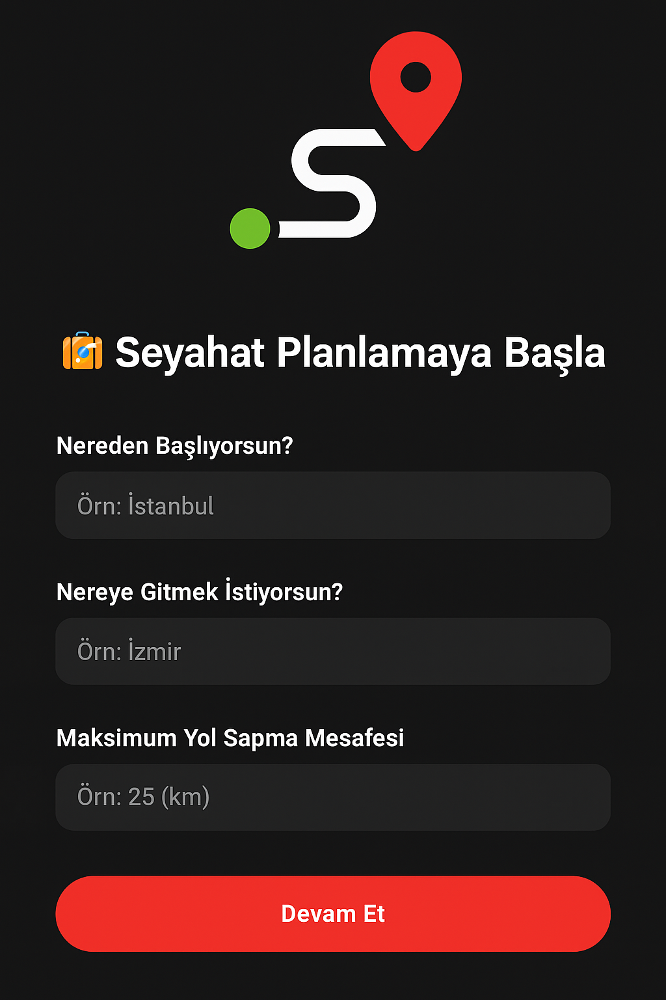
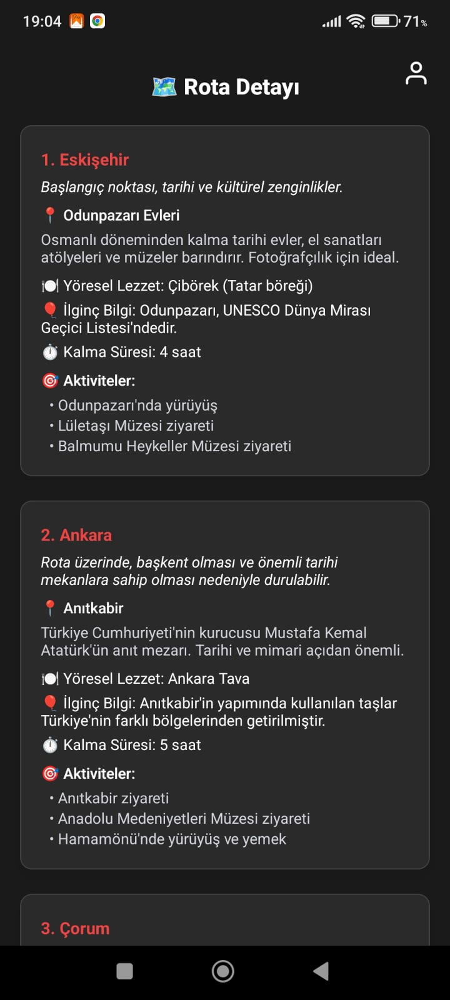

# 🌍 Geziver – Yapay Zeka Destekli Seyahat Planlayıcı

Geziver, kullanıcıların başlangıç ve varış noktalarına, ilgi alanlarına ve ulaşım tercihlerine göre kişiselleştirilmiş rotalar oluşturan, **yapay zeka destekli bir mobil seyahat planlama uygulamasıdır**. React Native & Expo mimarisi ile geliştirilen uygulama, Firebase altyapısıyla veri yönetimi ve geçmiş rota takibi imkânı sunar.

---

## 🚀 Temel Özellikler

- 🔐 **Google ile Kolay Giriş**  
  Google Gemini API ile desteklenen kullanıcı oturumu yönetimi.

- 🧠 **Yapay Zeka Destekli Rota Planlama**  
  Kullanıcının giriş yaptığı bilgiler ve tercihler doğrultusunda rota önerileri sunar.

- 📍 **Dinamik Güzergâh Oluşturma**  
  Nereden ve nereye gitmek istediğinizi belirtin, Geziver sizin için rota oluştursun.

- 🗂️ **İlgi Alanına Göre Öneriler**  
  Doğa, müze, alışveriş gibi seçilen kategorilere özel güzergâhlar.

- 🛣️ **Araç Tipine Göre Planlama**  
  Araba, otobüs, motosiklet, bisiklet ve yürüyüş gibi ulaşım tercihlerine uygun rota hesaplama.

- 🔄 **Firebase Entegrasyonu**  
  Oluşturulan rotalar Firebase’e kaydedilir. Kullanıcılar önceki seyahatlerini görüntüleyebilir, düzenleyebilir veya silebilir.

---

## 🛠️ Kullanılan Teknolojiler

- React Native (Expo)
- Google Gemini API
- Firebase Authentication & Firestore
- React Navigation
- Context API
- AsyncStorage

---

## 🖼️ Uygulama Ekran Görüntüleri

| Giriş Ekranı | Seyahat Bilgileri | İlgi Alanları | Özellikler |
|-------------|-------------------|---------------|------------|
|  |  |  |  |  |

> Alternatif olarak daha fazla ekran için:  
> -   
> -   
> -   
> - 

---
